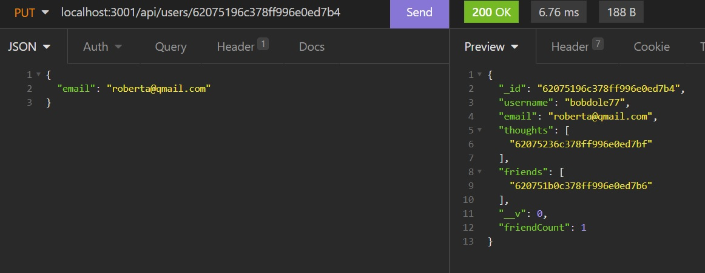

# The Best Social Network API

## Description
I made the Best Social Network API.

Explore the backend of a social network. Create, update, see, and delete users, friends, thoughts, and reactions. Do it with style. Do it with MongoDB and Mongoose.

Enjoy!

GitHub Repository: [https://github.com/jhur628/the-best-social-network-API](https://github.com/jhur628/the-best-social-network-API)

Walkthrough Video: [https://watch.screencastify.com/v/BmZYgcJNdFNZJRlGvZy3](https://watch.screencastify.com/v/BmZYgcJNdFNZJRlGvZy3)

## Table of Contents
1. [Installation](#Installation)
2. [Usage](#Usage)
3. [Credits](#Credits)
4. [Questions](#Questions)
5. [Screenshots](#Screenshots)
6. [License](#License)

## Installation
Ensure you have all libraries installed with "npm i"

Run the application with "npm start"

## Usage
This backend can be used via an API testing tool, such as: Insomnia or Postman.

Using different routes, users can view, create, update, and delete different documents from MongoDB.

When the user uses "/users" routes, the user can create a user, view all or a single user, update a user's information, or delete a user. The user also has the ability to add and delete a friend to the user.

When the user uses "/thoughts" routes, the user can create a thought, view all or a single thought, update a thought, or delete a thought. The user also has the ability to add and delete a reaction to a thought.

Please refer to the linked video for a walkthrough of the application.

## Credits
A lot of credit to my peers/friends/study group. Thank you for helping me stay focused and teaching me a thing or two about MongoDB and Mongoose. Thank you.

## Questions
Have any questions?  
Contact me at hur.john628.com.  
Github: https://github.com/jhur628/  

## Screenshots

## License
MIT   For more information on the MIT license, visit: https://opensource.org/licenses/MIT